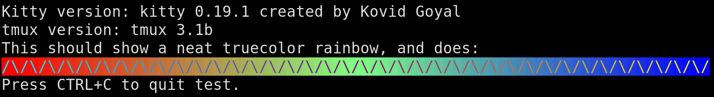
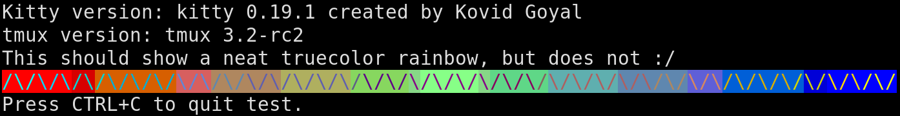

From what I can tell, the `tmux.conf` change fixes the issue on tmux-3.2-rc2, i.e.:

    set-option -as terminal-features ',xterm-kitty:RGB'

... is all it takes to fix it.

---

This repository contains a set of files that should help reproduce a problem
I've encountered using kitty and tmux 3.2-rc2: truecolor support fails to work
on 3.2-rc2 despite it working on 3.1b.

The culprit, from some cursory testing, seems to be a part of the following
kitty commit:

    commit 2ab6f57159ac4b406148208e2972c6784f502f78
    Author: Kovid Goyal <kovid@kovidgoyal.net>
    Date:   Thu Feb 8 10:26:13 2018 +0530
    Add non-standard terminfo capabilities

Specifically, this part:

    +    # Set RGB foreground color (non-standard used by neovim)
    +    'setrgbf': r'\E[38:2:%p1%d:%p2%d:%p3%dm',
    +    # Set RGB background color (non-standard used by neovim)
    +    'setrgbb': r'\E[48:2:%p1%d:%p2%d:%p3%dm',

How to use repo:

- install docker
- run `./test.sh`

Two docker images will be built:

- `tmux-kitty-colors-bug:3.1b`
- `tmux-kitty-colors-bug:3.2-rc` (the tmux code tag is `3.2-rc` but it's "really" `3.2-rc2`)

... and they'll be ran in succession, by mounting the local X11 socket and
setting the `DISPLAY` env var to ensure `kitty` is ran inside the container.
Once ran, it'll start the locally-built `tmux` version and will run
`./colortest.sh` - which will dump the version of `kitty` and `tmux` in use,
and will show a truecolor bar.

The truecolor bar works in tmux 3.1b, but fails to work on tmux 3.2-rc2:

tmux 3.1b example (works properly):

tmux 3.2-rc2 example (does not work properly):

